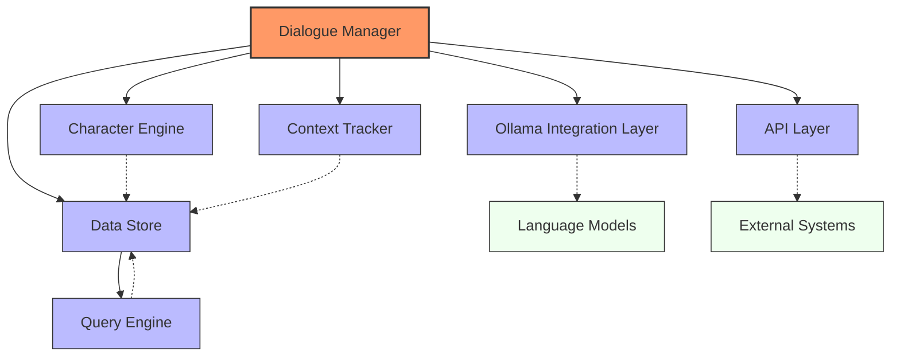
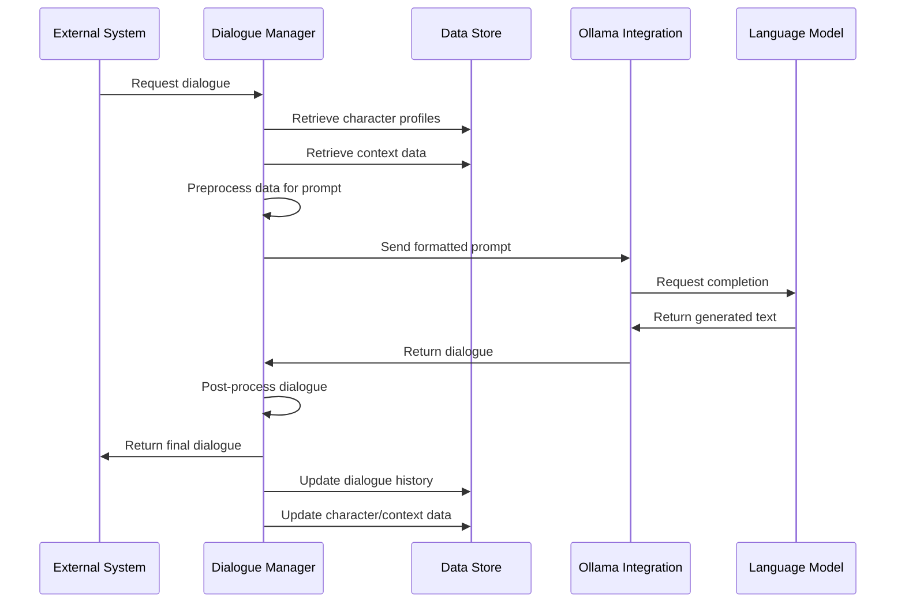
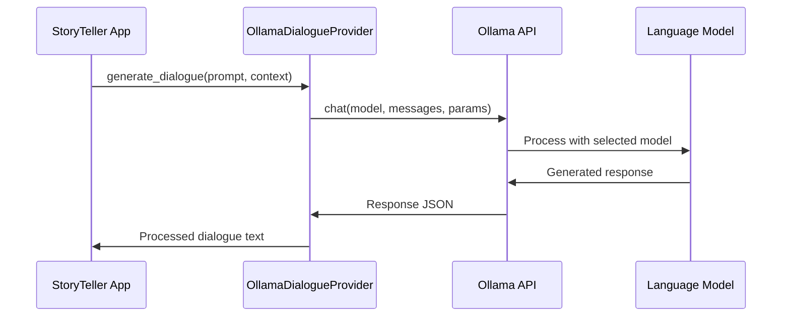
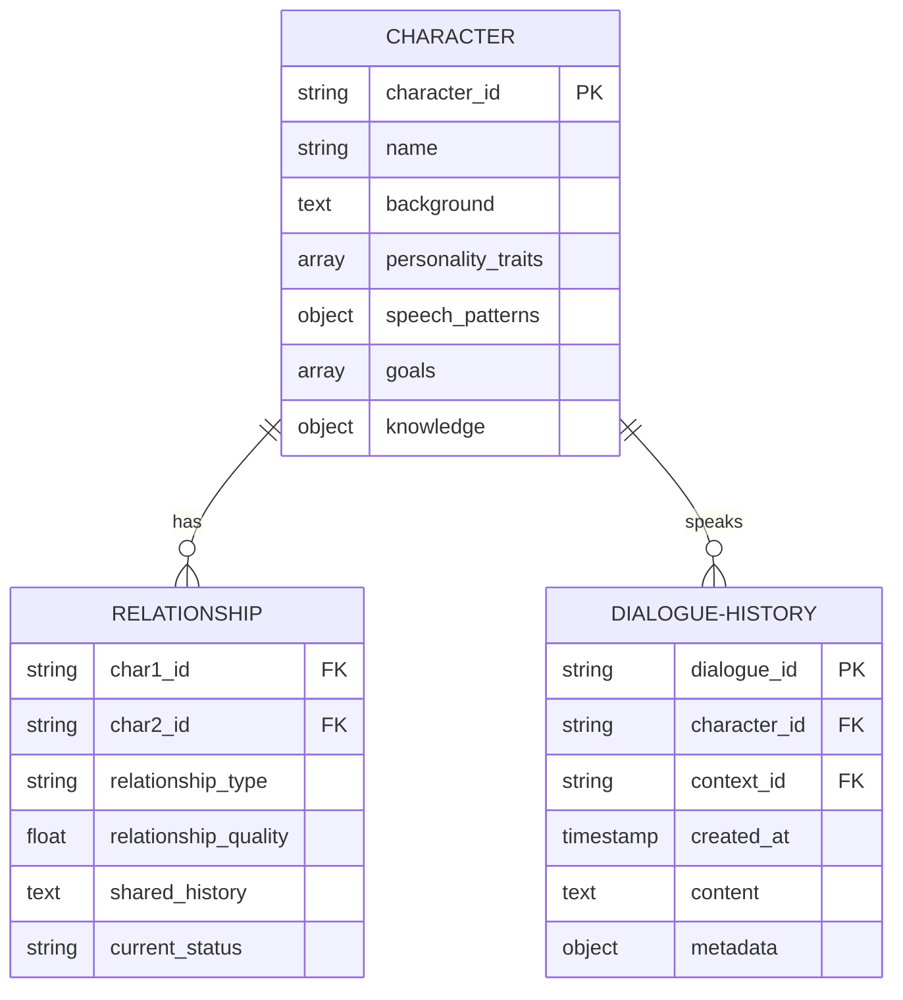
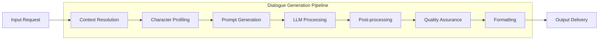
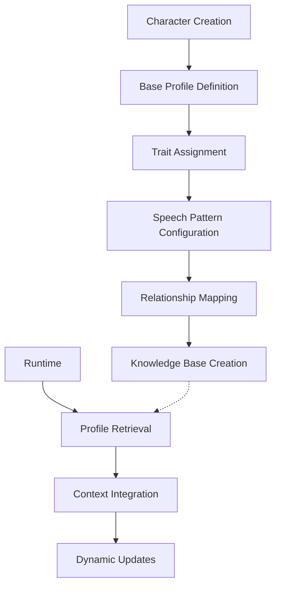
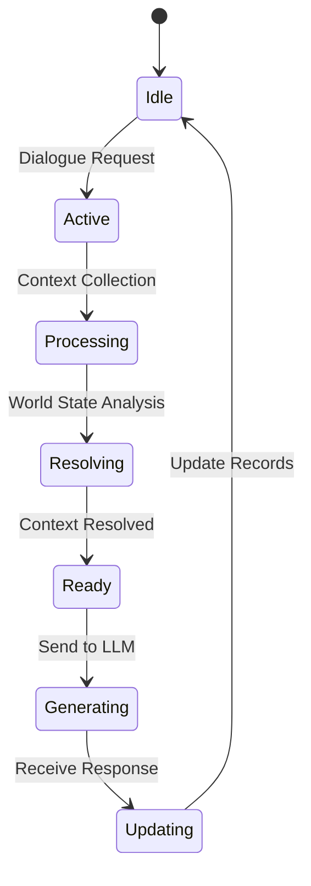
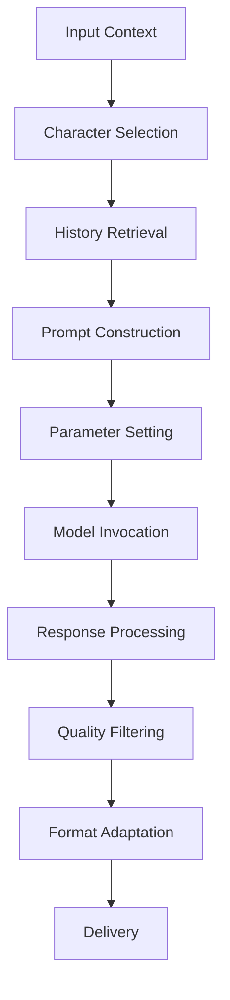
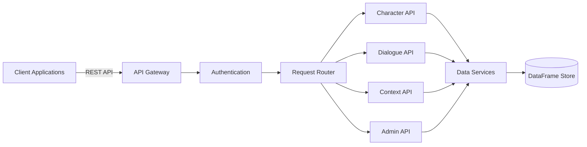
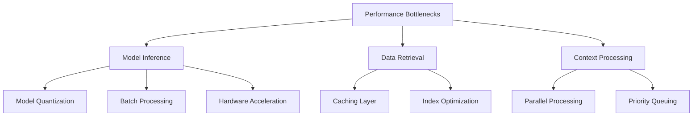

# StoryTeller: AI Dialogue Management System

## Abstract
StoryTeller is an advanced AI agent system designed to manage and create dynamic dialogue for interactive media including video games, television shows, movies, and other narrative content. The system leverages modern large language models through the Ollama framework, combined with efficient data management using pandas DataFrames and specialized query capabilities. StoryTeller aims to streamline the creative process for narrative designers while maintaining high-quality, contextually appropriate dialogue that adapts to the evolving states of characters and storylines.

## Table of Contents
1. [Introduction](#introduction)
2. [Overview](#overview)
3. [System Architecture](#system-architecture)
   1. [Core Components](#core-components)
   2. [Data Flow](#data-flow)
   3. [Integration Points](#integration-points)
4. [AI Model Framework](#ai-model-framework)
   1. [Ollama Integration](#ollama-integration)
   2. [Model Selection and Configuration](#model-selection-and-configuration)
5. [Data Management](#data-management)
   1. [Pandas DataFrames Structure](#pandas-dataframes-structure)
   2. [Query Engine Implementation](#query-engine-implementation)
6. [Dialogue Management System](#dialogue-management-system)
   1. [Character Profile Management](#character-profile-management)
   2. [Context Tracking](#context-tracking)
   3. [Dialogue Generation Pipeline](#dialogue-generation-pipeline)
7. [API and Integration](#api-and-integration)
8. [Performance Considerations](#performance-considerations)
9. [Future Enhancements](#future-enhancements)
10. [Conclusion](#conclusion)
11. [Appendix](#appendix)
    1. [Sample Dialogue Templates](#sample-dialogue-templates)
    2. [Configuration Examples](#configuration-examples)
    3. [Technical Dependencies](#technical-dependencies)

## Overview
The StoryTeller system addresses the complex challenge of creating dynamic, contextually-aware dialogue for interactive media. Traditionally, dialogue creation for video games and other media has relied on static scripts or basic branching dialogue trees, resulting in repetitive interactions and limited adaptability.

StoryTeller revolutionizes this process by implementing an AI-driven approach that:

- Maintains persistent character profiles and relationships
- Dynamically generates dialogue based on current storyline context
- Adapts to player choices and evolving narrative elements
- Ensures consistency with established character traits and story canon
- Scales efficiently across large narrative projects with multiple characters

The system is designed to serve as both a creative assistant for writers during development and as a runtime solution for generating dialogue in production environments. By leveraging state-of-the-art language models through Ollama, StoryTeller provides natural-sounding dialogue while maintaining control over narrative direction and character voice.

## System Architecture

### Core Components
The StoryTeller architecture consists of the following primary components:

1. **Dialogue Manager**: The central orchestration component that coordinates between all other modules and maintains the overall dialogue state.

2. **Character Engine**: Manages character profiles, traits, relationships, and historical interactions to inform dialogue generation.

3. **Context Tracker**: Monitors the current narrative state, including location, active quests/plotlines, recent events, and emotional tones.

4. **Ollama Integration Layer**: Handles communication with the Ollama framework to access and utilize large language models for dialogue generation.

5. **Data Store**: Implements pandas DataFrames for efficient storage and retrieval of character data, dialogue history, narrative elements, and configuration settings.

6. **Query Engine**: Utilizes llama_index.experimental.pandasqueryengine to enable complex queries against the DataFrame-based data store.

7. **API Layer**: Provides interfaces for external systems (game engines, content management systems, etc.) to request dialogue generation and manage system resources.



### Data Flow
1. External system requests dialogue for a character in a specific context
2. Dialogue Manager retrieves relevant character profiles and context data
3. Data is preprocessed and formatted into appropriate prompts
4. Ollama Integration Layer communicates with the language model
5. Generated dialogue is post-processed for quality assurance
6. Results are returned to the calling system while dialogue history is updated
7. Character and context data stores are updated to reflect new interaction



### Integration Points
- Game engines via REST API or SDK
- Scripting tools for writers and narrative designers
- Content management systems for TV/film production
- Character database management tools
- Analytics systems for monitoring dialogue quality and diversity

## AI Model Framework

### Ollama Integration
The system will leverage the `py-ollama` package as the primary interface to access large language models. This provides several advantages:

- Local model deployment for privacy and reduced latency
- Support for a variety of model architectures and sizes
- Simple API for prompt engineering and response handling
- Efficient resource utilization compared to cloud-based alternatives

Implementation will include:

```python
import ollama

class OllamaDialogueProvider:
    def __init__(self, model_name="llama3", params=None):
        self.model_name = model_name
        self.params = params or {}
    
    async def generate_dialogue(self, prompt, system_context=None):
        response = ollama.chat(
            model=self.model_name,
            messages=[
                {"role": "system", "content": system_context},
                {"role": "user", "content": prompt}
            ],
            **self.params
        )
        return response['message']['content']
```



### Model Selection and Configuration
StoryTeller will support configurable model selection to balance quality against performance requirements:

- Small models (7B-13B parameters) for rapid prototyping and resource-constrained environments
- Larger models (30B+ parameters) for production-quality dialogue
- Specialized fine-tuned models for specific genres or dialogue styles

## Data Management

### Pandas DataFrames Structure
The system will utilize pandas DataFrames as the primary data structure for:

- Character profiles and attributes
- Relationship networks between characters
- Dialogue history and patterns
- World state and contextual information
- Configuration settings and templates

Example DataFrame structures:

```python
import pandas as pd

# Character profile DataFrame
character_df = pd.DataFrame({
    'character_id': [],
    'name': [],
    'background': [],
    'personality_traits': [],
    'speech_patterns': [],
    'goals': [],
    'knowledge': []
})

# Relationship DataFrame
relationship_df = pd.DataFrame({
    'char1_id': [],
    'char2_id': [],
    'relationship_type': [],
    'relationship_quality': [],
    'shared_history': [],
    'current_status': []
})
```



### Query Engine Implementation
The system will implement llama_index.experimental.pandasqueryengine to enable natural language queries against the DataFrame structures:

```python
from llama_index.experimental.query_engine import PandasQueryEngine

class CharacterQueryEngine:
    def __init__(self, character_df, relationship_df):
        self.char_query_engine = PandasQueryEngine(character_df)
        self.rel_query_engine = PandasQueryEngine(relationship_df)
        
    def query_character_context(self, query_text):
        return self.char_query_engine.query(query_text)
        
    def query_relationships(self, query_text):
        return self.rel_query_engine.query(query_text)
```

This approach allows complex querying of character and context data using natural language rather than requiring explicit DataFrame operations.

## Dialogue Management System



### Character Profile Management


### Context Tracking


### Dialogue Generation Pipeline


## API and Integration


## Performance Considerations


## Appendix

### Technical Dependencies
- Python 3.9+
- ollama (Python client for Ollama)
- pandas
- llama-index
- numpy
- fastapi (for API layer)
- pydantic (for data validation)
- pytest (for testing framework)
- logging

### Sample Dialogue Templates
Templates will be provided for common dialogue scenarios:
- Character introductions
- Information exchange
- Emotional responses
- Quest/task delivery
- Conflict resolution

### Configuration Examples
Example configuration files for different deployment scenarios:
- Development environment setup
- Production deployment configuration
- Genre-specific model tuning parameters
