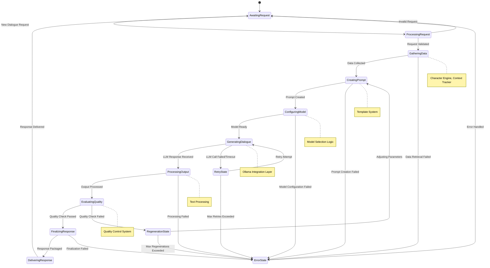

# StoryTeller: AI Dialogue Management System

## Abstract
StoryTeller is an advanced AI agent system, presented through a PyQt6 graphical user interface, designed to manage and create dynamic dialogue for interactive media including video games, television shows, movies, and other narrative content. The system leverages modern large language models (LLMs) via the Ollama framework, combined with efficient data management using pandas DataFrames and specialized query capabilities through LlamaIndex. StoryTeller aims to streamline the creative process for narrative designers by providing tools to manage characters, context, and generate high-quality, contextually appropriate dialogue that adapts to evolving narrative states, all managed via its dedicated GUI.

## Table of Contents
1. [Introduction](#introduction)
2. [Overview](#overview)
3. [Requirements](#requirements)
   1. [Functional Requirements](#functional-requirements)
   2. [Non-Functional Requirements](#non-functional-requirements)
4. [Use Cases](#use-cases)
   1. [UC-01: Generate NPC Greeting (via GUI)](#uc-01-generate-npc-greeting-via-gui)
   2. [UC-02: Update Character Relationship (via GUI)](#uc-02-update-character-relationship-via-gui)
   3. [UC-03: Create/Load Project (GUI)](#uc-03-createload-project-gui)
5. [System Architecture](#system-architecture)
   1. [Core Components](#core-components)
   2. [Component Interaction Map](#component-interaction-map)
      1. [Key Component Interfaces and Dependencies](#key-component-interfaces-and-dependencies)
   3. [GUI Application](#gui-application)
   4. [Data Flow](#data-flow)
      1. [Dialogue Generation Flow](#dialogue-generation-flow)
6. [AI Model Framework](#ai-model-framework)
   1. [Ollama Integration](#ollama-integration)
   2. [Model Selection and Configuration](#model-selection-and-configuration)
7. [Data Management](#data-management)
   1. [Core Entities and Relationships](#core-entities-and-relationships)
   2. [Pandas DataFrames Structure](#pandas-dataframes-structure)
   3. [Query Engine Implementation](#query-engine-implementation)
      1. [Component Integration](#component-integration)
      2. [Implementation Architecture](#implementation-architecture)
      3. [Data Flow Diagram for Query Processing](#data-flow-diagram-for-query-processing)
   4. [Application Configuration and User Data](#application-configuration-and-user-data)
   5. [Project Structure and Storage](#project-structure-and-storage)
8. [Dialogue Management System](#dialogue-management-system)
   1. [Core Data Flows and Component Integration](#core-data-flows-and-component-integration)
   2. [Key Dialogue System Components and their Functions](#key-dialogue-system-components-and-their-functions)
   3. [Character Profile Management](#character-profile-management)
   4. [Context Tracking](#context-tracking)
   5. [Dialogue Generation Pipeline](#dialogue-generation-pipeline)
      1. [Pipeline Stages](#pipeline-stages)
      2. [Pipeline State Transition Diagram](#pipeline-state-transition-diagram)
9. [API and Integration](#api-and-integration)
   1. [Internal Integration Architecture](#internal-integration-architecture)
   2. [External Integration Options](#external-integration-options)
10. [Deployment](#deployment)
    1. [PyInstaller Packaging](#pyinstaller-packaging)
11. [Performance Considerations](#performance-considerations)
12. [Future Enhancements](#future-enhancements)
13. [Conclusion](#conclusion)
14. [Appendix](#appendix)
    1. [Glossary](#glossary)
    2. [Project Directory Structure](#project-directory-structure)
    3. [Sample Dialogue Templates](#sample-dialogue-templates)
    4. [Configuration Examples](#configuration-examples)
    5. [Technical Dependencies](#technical-dependencies)
    6. [Component Interaction Examples](#component-interaction-examples)

## Introduction
StoryTeller is designed to address the challenges of creating dynamic, contextually-aware dialogue for interactive media. Presented through a dedicated PyQt6 graphical user interface, it leverages advanced AI models and efficient data management to provide a robust solution for narrative designers and developers. The intended audience includes game developers, writers, and media producers seeking to enhance their storytelling capabilities via an integrated desktop application.


## Overview
The StoryTeller system addresses the complex challenge of creating dynamic, contextually-aware dialogue for interactive media. Traditionally, dialogue creation for video games and other media has relied on static scripts or basic branching dialogue trees, resulting in repetitive interactions and limited adaptability.

StoryTeller revolutionizes this process by implementing an AI-driven approach that:

- Maintains persistent character profiles and relationships
- Dynamically generates dialogue based on current storyline context
- Adapts to player choices and evolving narrative elements
- Ensures consistency with established character traits and story canon
- Scales efficiently across large narrative projects with multiple characters

The system is designed primarily as a desktop application with a PyQt6 GUI, serving as a creative assistant for writers during development. It can also potentially expose its core logic via an API for runtime integration, but the primary interaction model is through the GUI. By leveraging state-of-the-art language models through Ollama, StoryTeller provides natural-sounding dialogue while maintaining control over narrative direction and character voice.

## Requirements

### Functional Requirements
- **FR-01:** The system must generate dialogue for specified characters based on provided context (speaker, listener(s), situation).
- **FR-02:** The system must maintain persistent profiles for characters, including unique IDs, names, traits, background, relationships, knowledge, goals, and speech patterns.
- **FR-03:** The system must track the narrative context, including location, time, active plot points, recent events, and character emotional states.
- **FR-04:** The system must allow querying of character, relationship, and context data using natural language via the Query Engine.
- **FR-05:** The system must integrate with Ollama to utilize various locally hosted large language models.
- **FR-06:** The system must store and manage project data (characters, relationships, context, dialogue history) primarily using pandas DataFrames.
- **FR-07:** The system *may* provide an optional API for integration with external systems (e.g., game engines) for runtime generation.
- **FR-08:** Dialogue generation must consider character personality, relationships (speaker-listener dynamics), current emotional state, and relevant context.
- **FR-09:** The system must log dialogue generation requests, parameters, responses, and quality assessments for analysis and debugging within the project's data.
- **FR-10:** The system must allow GUI-based configuration of different language models and generation parameters (temperature, top-k, etc.) per project or globally.
- **FR-11:** The GUI application must allow users to create, save, and load distinct StoryTeller projects to user-specified locations.
- **FR-12:** Application-specific user settings (e.g., default model, API keys, window layout, recent projects) must be stored persistently in the standard user application data directory (`%LOCALAPPDATA%\StoryTeller` on Windows or equivalent).
- **FR-13:** The PyQt6 GUI application must provide interfaces for managing projects, characters, relationships, context, generating/testing dialogue, and configuring settings.
- **FR-14:** The application should be packageable into a standalone executable using PyInstaller for ease of distribution.

### Non-Functional Requirements
- **NFR-01:** **Performance:** Dialogue generation latency should be acceptable for interactive use within the GUI. Aim for < 5 seconds for typical requests with medium-sized models, configurable based on model choice. Runtime API (if implemented) should target < 2 seconds for smaller models.
- **NFR-02:** **Scalability:** The system should handle projects with a significant number of characters (target: 1000+) and extensive dialogue history without prohibitive performance degradation in data loading, querying, or GUI responsiveness.
- **NFR-03:** **Reliability:** The system must handle errors gracefully (e.g., model unavailability, invalid input, corrupted data files) with informative feedback to the user and maintain data integrity.
- **NFR-04:** **Maintainability:** Code must adhere to standard Python practices (PEP 8), be well-documented (docstrings, comments), modular, and include unit/integration tests.
- **NFR-05:** **Security:** Local model usage via Ollama enhances data privacy. Sensitive information like API keys (if any) should be stored securely. Project data access is managed by filesystem permissions.
- **NFR-06:** **Usability:** The PyQt6 GUI should be intuitive for narrative designers, featuring a modern design, clear workflow, helpful tooltips, and accessible configuration options.
- **NFR-07:** **Extensibility:** The architecture should facilitate adding new data sources, context types, AI model providers, or integration methods in the future with minimal disruption to existing components.
- **NFR-08:** **Installation:** Provide a straightforward installation method, ideally via a PyInstaller-packaged executable for major operating systems (Windows, macOS, Linux).

## Use Cases

### UC-01: Generate NPC Greeting (via GUI)
- **Actor:** Narrative Designer (using GUI)
- **Trigger:** User initiates dialogue generation for an NPC via the GUI's testing interface.
- **Goal:** Generate a contextually appropriate greeting from the NPC and display it in the GUI.
- **Steps:**
    1. User selects NPC, Player (or target), specifies context (location, time, events) in the GUI.
    2. GUI sends request details to the StoryTeller core logic (Dialogue Manager).
    3. StoryTeller retrieves NPC profile, Player profile, relationship data, and world state context from the Data Store.
    4. StoryTeller constructs a prompt incorporating the retrieved data.
    5. StoryTeller sends the prompt to the configured Ollama model via the Ollama Integration Layer.
    6. StoryTeller receives the generated greeting, performs post-processing.
    7. StoryTeller returns the greeting text to the GUI.
    8. GUI displays the generated greeting to the user.
    9. StoryTeller updates the dialogue history (if configured to do so during testing).

### UC-02: Update Character Relationship (via GUI)
- **Actor:** Narrative Designer (using GUI)
- **Trigger:** User modifies a relationship attribute between two characters in the GUI's character editor.
- **Goal:** Update the relationship status between two characters in the Data Store based on GUI input.
- **Steps:**
    1. User navigates to the character relationship editor in the GUI.
    2. User selects two characters and modifies their relationship data (e.g., changes quality score, adds a note to shared history).
    3. GUI sends the updated relationship data to the StoryTeller core logic (Character Engine).
    4. StoryTeller Character Engine validates and updates the relevant entry in the `relationship_df` DataFrame.
    5. StoryTeller confirms the update was successful back to the GUI.
    6. GUI refreshes the display to show the updated relationship.

### UC-03: Create/Load Project (GUI)
- **Actor:** Narrative Designer (using GUI)
- **Trigger:** User selects "New Project" or "Open Project" from the GUI menu.
- **Goal:** Create a new, empty project structure in a chosen directory or load an existing project's data into the application.
- **Steps (New Project):**
    1. User selects "New Project".
    2. GUI prompts user to select a directory and name for the new project.
    3. Upon confirmation, the GUI creates the necessary project folder structure (e.g., `/data`, `/config`) in the specified location.
    4. Initial empty data files (e.g., `characters.csv`, `relationships.csv`) are created.
    5. The GUI loads the empty project state.
- **Steps (Load Project):**
    1. User selects "Open Project".
    2. GUI prompts user to select the root directory of an existing StoryTeller project.
    3. GUI validates the selected directory structure and files.
    4. GUI loads the data (character DataFrames, context info, project-specific settings) from the project files into the application's runtime memory (Data Store).
    5. The GUI reflects the loaded project state.


## System Architecture

### Core Components
The StoryTeller architecture is composed of several distinct components, each with specific responsibilities, designed for modularity and maintainability.

1.  **Dialogue Manager**: The central orchestrator. It receives dialogue requests (primarily from the GUI), coordinates interactions between other components (Character Engine, Context Tracker, Ollama Integration) to gather necessary data, manages the dialogue generation pipeline, handles post-processing and quality control, and returns the final dialogue. It also manages dialogue session state and history logging.

2.  **Character Engine**: The authority on character information. It manages the creation, retrieval, updating, and deletion (CRUD) of character profiles and their relationships. It ensures data consistency for characters and provides methods for querying character traits, knowledge, and relationship dynamics, often interacting with the Data Store and Query Engine.

3.  **Context Tracker**: Manages the dynamic state of the narrative world. It tracks and provides relevant contextual information (spatial, temporal, narrative, social, emotional) needed for dialogue generation. It aggregates context from various sources (e.g., user input via GUI, project data) and determines relevance based on the current dialogue request.

4.  **Ollama Integration Layer**: The interface to the AI models. It handles all communication with the Ollama service, including sending formatted prompts, managing model parameters, receiving generated text, and handling potential API errors or retries. It abstracts the specifics of the Ollama API from the rest of the system.

5.  **Data Store**: The persistence layer. Primarily implemented using pandas DataFrames held in memory during application runtime, it manages the loading, saving, and querying of all project-specific data (characters, relationships, dialogue history, context timeline, world state). It handles serialization/deserialization to/from persistent file formats (CSV, Parquet, JSON) within the project directory.

6.  **Query Engine**: The natural language interface to the Data Store. Built upon `llama_index.experimental.pandasqueryengine`, it allows components like the Character Engine or Context Tracker to query the DataFrames using natural language prompts, translating them into pandas operations. This simplifies data retrieval for complex or nuanced requests.

7.  **GUI Application (PyQt6)**: The primary user interface. It provides visual tools for project management, character/context editing, dialogue testing, configuration, and visualization. It interacts with the core components (Dialogue Manager, Character Engine, Context Tracker) to display data and initiate actions.

8.  **API Layer (Optional Runtime)**: A potential future extension providing a programmatic interface (e.g., REST API via FastAPI) for external systems like game engines to interact directly with the core logic, bypassing the GUI, primarily for runtime dialogue generation scenarios.

### Component Interaction Map


#### Key Component Interfaces and Dependencies

| Component Pair | Interface Description | Shared Entities | Data Flow Direction |
|----------------|------------------------|-----------------|---------------------|
| GUI ↔ Dialogue Manager | High-level dialogue generation requests and responses | DialogueRequest, DialogueResponse | Bidirectional |
| GUI ↔ Character Engine | Character CRUD operations | Character, Relationship | Bidirectional |
| GUI ↔ Context Tracker | Context updating and retrieval | Context, WorldState | Bidirectional |
| Dialogue Manager ↔ Character Engine | Character profile querying | Character, Relationship | DM reads from CE |
| Dialogue Manager ↔ Context Tracker | Context retrieval for dialogue generation | Context, DialogueContext | DM reads from CT |
| Dialogue Manager ↔ Ollama Integration | Prompt submission and response handling | Prompt, Completion | Bidirectional |
| Character Engine ↔ Data Store | Character data persistence | Character, Relationship DataFrames | Bidirectional |
| Context Tracker ↔ Data Store | Context data persistence | Context, WorldState DataFrames | Bidirectional |
| Query Engine ↔ Data Store | Natural language data queries | DataFrames, Query, QueryResult | QE reads from DS |
| Ollama Integration ↔ LLMs | Model invocation | Prompts, Parameters, Completions | Bidirectional |

### GUI Application
The desktop GUI application, built using the PyQt6 framework, is the primary interface for interacting with the StoryTeller system. It provides a user-friendly environment for narrative designers and writers with a modern, intuitive interface.

**Key Features:**
- **Project Management:** 
  - Create, open, and save StoryTeller projects with intuitive navigation
  - Recent projects list for quick access
  - Project templates for common narrative scenarios

- **Character Editor:** 
  - Visual interface for creating and editing character profiles
  - Personality trait sliders for intuitive character development
  - Relationship network visualization with interactive graph
  - Bulk character import from spreadsheets
  - AI-assisted character development suggestions

- **Context Editor:**
  - Visual timeline for narrative events
  - Location management with visual mapping
  - World state variables dashboard
  - Context presets for common scenarios (day/night, emotional tones)

- **Dialogue Tester:** 
  - Interactive dialogue playground with character selection
  - Context variable adjustment in real-time
  - Multiple output variations for comparison
  - Dialogue history tracking
  - Export options for generated content

- **Configuration:**
  - Model selection with performance indicators
  - Parameter presets for different use cases (quality vs. speed)
  - Visual theme customization
  - Custom templates manager

- **Data Visualization:** 
  - Interactive relationship networks
  - Character trait comparisons
  - Dialogue pattern analysis
  - Context impact visualization

The GUI employs a modern design with dockable panels, dark/light themes, and smooth transitions, providing an experience similar to professional creative tools.


### Data Flow
The primary data flow is initiated by user actions within the GUI, which trigger operations in the core components, interact with the Data Store and Ollama, and return results to be displayed in the GUI. If a runtime API is exposed, the flow described previously (initiated by an external system) becomes relevant.

#### Dialogue Generation Flow

1. **User Input Phase**
   - User selects characters and sets context parameters in GUI
   - GUI validates input and creates a structured DialogueRequest object
   - DialogueRequest is passed to the Dialogue Manager

2. **Context Assembly Phase**
   - Dialogue Manager requests relevant character profiles from Character Engine
   - Character Engine retrieves profile data from Data Store or uses Query Engine for complex lookups
   - Dialogue Manager requests context information from Context Tracker
   - Context Tracker aggregates relevant spatial, temporal, narrative, and emotional context
   - All retrieved data is assembled into a DialogueContext object

3. **Prompt Creation Phase**
   - Dialogue Manager constructs a PromptTemplate based on dialogue type
   - DialogueContext is formatted according to the template
   - Generation parameters (temperature, top_k, etc.) are selected based on configuration

4. **Generation Phase**
   - Prompt and parameters are passed to Ollama Integration Layer
   - Ollama Integration Layer submits request to appropriate LLM
   - LLM processes request and returns completion
   - Ollama Integration Layer receives and pre-processes the response

5. **Post-Processing Phase**
   - Dialogue Manager receives raw completion text
   - Text is processed for format, consistency, and appropriateness
   - Quality checks are performed (length, topic adherence, character voice)
   - If quality checks fail, generation may be retried with modified parameters

6. **Response Phase**
   - Processed dialogue is packaged as a DialogueResponse object
   - Dialogue history is updated in Data Store
   - DialogueResponse is returned to GUI
   - GUI presents dialogue to the user with options for regeneration or editing


## AI Model Framework

### Ollama Integration
The system will leverage the `py-ollama` package as the primary interface to access large language models. This provides several advantages:

- Local model deployment for privacy and reduced latency
- Support for a variety of model architectures and sizes
- Simple API for prompt engineering and response handling
- Efficient resource utilization compared to cloud-based alternatives

Implementation will include:

```python
import ollama

class OllamaDialogueProvider:
    def __init__(self, model_name="llama3", params=None):
        self.model_name = model_name
        self.params = params or {}
    
    async def generate_dialogue(self, prompt, system_context=None):
        response = ollama.chat(
            model=self.model_name,
            messages=[
                {"role": "system", "content": system_context},
                {"role": "user", "content": prompt}
            ],
            **self.params
        )
        return response['message']['content']
```


### Model Selection and Configuration
StoryTeller will support configurable model selection to balance quality against performance requirements:

- Small models (7B-13B parameters) for rapid prototyping and resource-constrained environments
- Larger models (30B+ parameters) for production-quality dialogue
- Specialized fine-tuned models for specific genres or dialogue styles


## Data Management

### Core Entities and Relationships

The system revolves around several primary entities and their relationships:

1. **Character**: The foundation of the dialogue system representing individual personalities that can engage in dialogue.
   - Properties: Unique identifier, name, background, personality traits, speech patterns, goals, knowledge, etc.
   - Relationships: Has relationships with other characters, speaks dialogue, exists within contexts

2. **Relationship**: Represents connections between characters that influence dialogue.
   - Properties: Relationship type, quality/sentiment score, shared history, current status
   - Relationships: Links two characters, influences dialogue context

3. **Context**: Represents situational information relevant to dialogue generation.
   - Types: Spatial (location), Temporal (time), Narrative (story state), Social (nearby characters), Emotional (mood)
   - Properties: Context type, value, priority, timestamp, relevance score
   - Relationships: Applies to dialogue, involves characters, part of world state

4. **Dialogue**: The actual conversational text generated by the system.
   - Properties: Content text, metadata (tone, intent), timestamp, version
   - Relationships: Spoken by character(s), occurs within context, part of dialogue history

5. **Project**: Contains all other entities for a specific narrative work.
   - Properties: Name, description, settings, creation/modification dates
   - Relationships: Contains characters, contexts, dialogue history, world state


### Pandas DataFrames Structure
The system will utilize pandas DataFrames as the primary data structure for:

- Character profiles and attributes
- Relationship networks between characters
- Dialogue history and patterns
- World state and contextual information
- Configuration settings and templates

Example DataFrame structures:

```python
import pandas as pd

# Character profile DataFrame
character_df = pd.DataFrame({
    'character_id': [],
    'name': [],
    'background': [],
    'personality_traits': [],
    'speech_patterns': [],
    'goals': [],
    'knowledge': []
})

# Relationship DataFrame
relationship_df = pd.DataFrame({
    'char1_id': [],
    'char2_id': [],
    'relationship_type': [],
    'relationship_quality': [],
    'shared_history': [],
    'current_status': []
})
```


### Query Engine Implementation

The Query Engine, leveraging LlamaIndex's `PandasQueryEngine`, acts as an intelligent intermediary between components needing data and the raw DataFrames in the Data Store. It translates natural language questions into executable pandas code, enabling more flexible and semantic data retrieval.

**Component Integration:**

1.  **Character Engine:** Uses the Query Engine for complex character filtering ("Find characters skilled in negotiation"), relationship analysis ("Who are the rivals of character X?"), and historical queries ("Show characters whose primary goal changed recently").
2.  **Context Tracker:** Employs the Query Engine to find relevant past events ("What significant events occurred at this location?"), analyze contextual relationships ("How does the current weather typically affect this character's mood?"), and perform temporal lookups ("Retrieve the world state from the previous chapter").
3.  **Dialogue Manager:** May use the Query Engine for advanced dialogue history analysis ("Find examples of this character being sarcastic"), pattern identification, or retrieving specific past interactions based on semantic content.
4.  **GUI (Potentially):** Future enhancements could allow users to directly query project data via a natural language input in the GUI, powered by the Query Engine.

**Implementation Architecture:**

```python
from llama_index.experimental.query_engine import PandasQueryEngine
from llama_index.llms.ollama import Ollama 

class StoryTellerQueryEngine:
    def __init__(self, dataframes: dict, llm_model="llama3"):
        self.engines = {}
        self.llm = Ollama(model=llm_model)
        self._initialize_engines(dataframes)
        self.query_cache = {}  # For caching frequent queries
        self.query_history = []  # For optimization and analytics
        
    def _initialize_engines(self, dataframes: dict):
        for name, df in dataframes.items():
            # Create specific query engines for each DataFrame
            self.engines[name] = PandasQueryEngine(
                df=df, 
                llm=self.llm,
                verbose=True,
                instruction_str=self._get_instruction_for_df(name)
            ) 
            
    def _get_instruction_for_df(self, df_name: str) -> str:
        """Returns specialized instructions based on DataFrame type"""
        instructions = {
            'characters': 'Answer queries about character profiles, traits, and attributes.',
            'relationships': 'Answer queries about character relationships, their quality, and history.',
            'dialogue_history': 'Answer queries about past dialogues, patterns, and context.',
            'context': 'Answer queries about narrative context, locations, and events.'
        }
        return instructions.get(df_name, 'Answer queries about this data.')
            
    def query_dataframe(self, df_name: str, query_text: str):
        # Check cache first
        cache_key = f"{df_name}:{query_text}"
        if cache_key in self.query_cache:
            return self.query_cache[cache_key]
            
        if df_name in self.engines:
            try:
                # Log query for analytics
                self.query_history.append({
                    'timestamp': datetime.now(),
                    'dataframe': df_name,
                    'query': query_text
                })
                
                # Execute query
                response = self.engines[df_name].query(query_text)
                
                # Cache results
                self.query_cache[cache_key] = response
                
                return response
            except Exception as e:
                logging.error(f"Error querying dataframe {df_name}: {e}")
                return None
        else:
            logging.error(f"Error: Dataframe {df_name} not found.")
            return None
            
    def cross_dataframe_query(self, query_text: str):
        """Handle queries that span multiple DataFrames"""
        # Implementation would analyze the query to determine which DataFrames are relevant
        # and then execute coordinated queries across them
        pass
```

**Data Flow Diagram for Query Processing:**


### Application Configuration and User Data
User-specific application settings that are not tied to a particular project will be stored persistently in the standard user application data directory.
- **Location:** `%LOCALAPPDATA%\StoryTeller` on Windows (or equivalent paths on macOS/Linux, e.g., `~/.local/share/StoryTeller` or `~/Library/Application Support/StoryTeller`). Standard Python libraries like `platformdirs` can be used to determine the correct location.
- **Content:** May include default Ollama model selection, API keys (if used), GUI layout preferences, recent project list, global templates.
- **Format:** Configuration files (e.g., INI, JSON, YAML) or a small database (e.g., SQLite).

This separation ensures that user preferences persist across sessions and are distinct from the actual narrative data stored within projects.


### Project Structure and Storage
StoryTeller projects encapsulate all the data related to a specific narrative work (game, movie script, etc.).
- **User Choice:** Users will create/save projects in directories of their choosing via a file browser dialog.
- **Project Root Directory:** Contains all project-related files and subdirectories.
- **Structure (Example):**
    ```
    MyGameProject/
    ├── project_settings.json  # Project-specific config (e.g., model used for this project)
    ├── data/
    │   ├── characters.csv       # Character profiles DataFrame
    │   ├── relationships.csv    # Relationships DataFrame
    │   ├── dialogue_history.parquet # Dialogue logs (Parquet for efficiency)
    │   ├── world_state.json     # Current world context
    │   └── context_timeline.json # Timeline of narrative events
    ├── templates/
    │   └── custom_prompts.txt   # Project-specific prompt templates
    └── exports/
        ├── dialogue_exports/    # Exported dialogue scripts
        └── character_sheets/    # Exported character documentation
    ```

The project structure is designed for clarity and ease of access, with intuitive organization that supports creative workflows. Files can be easily shared and modified using standard tools when needed.

### Project Directory Structure

Below is the planned directory structure for the StoryTeller application source code. This structure is designed for modularity, maintainability, and extensibility. Each directory and file is mapped to a major architectural concern or feature described in this specification.


**File/Feature Mapping:**

- **Dialogue Management Pipeline:**  
  - `core/dialogue_manager.py`, `ai/ollama_integration.py`, `ai/prompts.py`, `ai/postprocessor.py`, `ai/quality_control.py`
- **Character & Relationship Management:**  
  - `core/character_engine.py`, `data/models.py`, `data/serializer.py`, `data/validator.py`, `gui/views/character_editor_view.py`, `gui/views/relationship_editor_view.py`
- **Context Tracking:**  
  - `core/context_tracker.py`, `gui/views/context_editor_view.py`
- **Query Engine:**  
  - `ai/query_engine.py`, `core/character_engine.py`, `core/context_tracker.py`
- **GUI:**  
  - `gui/main_window.py`, `gui/views/`, `gui/dialogs/`, `gui/widgets/`, `gui/views/dialogue_tester_view.py`, `gui/views/dialogue_history_view.py`, `gui/views/settings_view.py`
- **Persistence & Serialization:**  
  - `core/data_store.py`, `data/serializer.py`, `data/validator.py`
- **Configuration:**  
  - `config/config_loader.py`, `config/defaults.py`, `utils/file_utils.py`
- **Utilities:**  
  - `utils/logger.py`, `utils/helpers.py`
- **Testing:**  
  - `tests/` (unit and integration tests for all modules)
- **Resources:**  
  - `resources/` (icons, UI files, default prompt templates, etc.)

**Extensibility Points:**
- Plugins: Add new files to `src/plugins/` (future).
- New AI providers: Add new modules to `ai/` and update `dialogue_manager.py`.
- New GUI panels: Add new views to `gui/views/`.

**Note:**  
All files should include docstrings and type annotations.  
All modules should be covered by unit tests in `tests/`.

---

## Dialogue Management System

The Dialogue Management System (DMS) is the heart of StoryTeller's generation capability. It orchestrates the process of transforming a dialogue request into contextually appropriate, character-consistent dialogue text. It comprises several sub-components working in sequence.

### Core Data Flows and Component Integration


### Key Dialogue System Components and their Functions

1.  **Dialogue Manager (Coordinator)**
    - **Role:** Acts as the central controller for the DMS. Receives requests, sequences pipeline stages, manages data flow between sub-components and supporting systems (CE, CT, OIL, DS), handles errors, and returns the final response.
    - **Inputs:** `DialogueRequest` (from GUI/API), Configuration settings.
    - **Outputs:** `DialogueResponse` (to GUI/API), Dialogue history entries (to DS).

2.  **Dialogue Generator (Prompt Engineer & LLM Interface)**
    - **Role:** Responsible for constructing the final prompt sent to the LLM. Selects appropriate templates, integrates character voice, context, and constraints, selects generation parameters, and interacts with the `OllamaIntegration` layer to invoke the LLM.
    - **Inputs:** `DialogueContext` (character profiles, relationships, context data), `DialogueRequest` parameters, Prompt templates.
    - **Outputs:** Raw text completion from the LLM.

3.  **Dialogue Processor (Text Refiner)**
    - **Role:** Takes the raw output from the LLM and refines it. Cleans formatting artifacts, enforces character-specific speech patterns (if defined), extracts potential metadata (e.g., implied emotion, intent - potentially using another LLM call or rule-based system), and structures the output.
    - **Inputs:** Raw LLM completion text.
    - **Outputs:** `DialogueContent` object (structured, cleaned text + metadata).

4.  **Dialogue Quality Control (Validator)**
    - **Role:** Assesses the processed dialogue against predefined quality criteria. Checks for consistency (character voice, knowledge), contextual relevance, coherence, adherence to constraints (length, tone), and safety/appropriateness. Decides whether to approve, reject, or trigger regeneration.
    - **Inputs:** `DialogueContent` object, Quality criteria configuration.
    - **Outputs:** QA assessment result (Pass/Fail/Regenerate), Approved `DialogueContent`.

### Character Profile Management

This component is responsible for the lifecycle of character data. It involves:
- **Creation:** Defining new characters with their core attributes (ID, name, background).
- **Enrichment:** Adding detailed personality traits, speech patterns (e.g., formality, vocabulary, common phrases), goals, and initial knowledge. Tools might be provided for narrative designers to input this data.
- **Relationship Mapping:** Defining initial relationships between characters using the `relationship_df`.
- **Runtime Retrieval:** Fetching specific character data needed for dialogue generation.
- **Dynamic Updates:** Modifying character profiles based on in-game events or narrative progression (e.g., learning new information, changing goals, shifts in relationships). Updates are persisted in the DataFrames.


### Context Tracking

The Context Tracker maintains the current state relevant to dialogue generation. This includes:
- **Spatial Context:** Character location, environment type.
- **Temporal Context:** Time of day, current date/season.
- **Narrative Context:** Active quests, recent significant events, current plot phase.
- **Social Context:** Nearby characters, group dynamics.
- **Emotional Context:** Overall mood of the scene, character-specific emotional states derived from recent events or explicit states.
Data is gathered from the game engine or other integrated systems via the API and stored/updated, potentially in dedicated DataFrames or integrated into character/dialogue history.


### Dialogue Generation Pipeline

The Dialogue Generation Pipeline orchestrates the step-by-step transformation of a request into dialogue.

#### Pipeline Stages

1.  **Input Processing:** Validates the incoming `DialogueRequest`, normalizes parameters, and prepares it for processing.
2.  **Data Retrieval:** Gathers all necessary information (character profiles, relationships, context, history) via the Character Engine and Context Tracker, assembling it into a `DialogueContext`.
3.  **Prompt Engineering:** Constructs the LLM prompt using selected templates, character voice instructions, the `DialogueContext`, and specified constraints.
4.  **Model Configuration:** Selects the target LLM and determines optimal generation parameters (temperature, top-k, etc.) based on the request and configuration.
5.  **Generation Execution:** Submits the prompt and parameters to the Ollama Integration Layer and awaits the raw text completion. Handles retries on failure.
6.  **Post-Processing:** Cleans, formats, and potentially extracts metadata from the raw LLM output, creating a structured `DialogueContent` object.
7.  **Quality Assurance:** Evaluates the `DialogueContent` against quality criteria. May trigger regeneration (returning to Stage 3/4 with adjusted parameters) if checks fail.
8.  **Finalization:** Packages the approved `DialogueContent` into a `DialogueResponse`, logs the interaction to the Data Store, and prepares the response for delivery.

**Pipeline State Transition Diagram**



## API and Integration

### Internal Integration Architecture

The core components integrate with each other through well-defined interfaces:


### External Integration Options

Although the PyQt6 GUI is the primary interface, StoryTeller can be extended to support various external integration methods:

1. **REST API (Optional Extension)**
   - Expose core functionality through a RESTful API
   - Enable integration with game engines, web applications, or other tools
   - Implement endpoints for dialogue generation, character management, etc.
   - Use standard HTTP methods and status codes for operations
   - Secure endpoints with authentication and rate limiting

2. **Python Package Integration**
   - Allow embedding StoryTeller within other Python applications
   - Export key classes and functions for direct use
   - Provide integration examples and documentation

3. **File-based Integration**
   - Support import/export of characters, dialogues, and contexts in standard formats (CSV, JSON)
   - Enable batch processing of dialogue requests through file handling
   - Implement file watchers for continuous integration with external tools

4. **Plugin System (Future Enhancement)**
   - Define a plugin architecture for extending StoryTeller
   - Allow custom dialogue processors, context providers, or character sources
   - Support third-party enhancements without modifying core code


## Deployment

### PyInstaller Packaging
To simplify distribution and installation for end-users, the StoryTeller PyQt6 application will be packaged into a standalone executable using PyInstaller.
- **Process:** A PyInstaller spec file will be configured to bundle the Python interpreter, StoryTeller source code, required dependencies (PyQt6, pandas, ollama, llama-index, etc.), and any necessary assets.
- **Output:** A single executable file or a folder containing the executable and its dependencies, runnable on the target operating system (Windows, macOS, Linux) without requiring a separate Python installation.
- **Considerations:** Careful management of dependencies, hidden imports, and data file inclusion within the PyInstaller build process will be required.


## Performance Considerations
Optimizing performance is crucial, especially for runtime dialogue generation. Key areas include:
- **Model Choice:** Balancing model size/capability vs. inference speed. Smaller models (e.g., quantized versions) for faster responses.
- **Inference Optimization:** Utilizing hardware acceleration (GPU), batching requests where possible, optimizing Ollama server configuration.
- **Data Access:** Efficient DataFrame indexing and querying. Caching frequently accessed profiles or context states.
- **Prompt Efficiency:** Crafting concise yet effective prompts to minimize token usage and processing time.
- **Asynchronous Operations:** Using async processing for API calls and model interactions to avoid blocking.
- **Load Balancing:** Distributing requests across multiple StoryTeller instances or Ollama servers if needed.


## Future Enhancements
Future improvements may include:
- **Visual Storyboarding:** Interactive visualization of dialogue scenes with character positioning and mood.
- **Voice Synthesis Integration:** Generate spoken dialogue using text-to-speech systems.
- **Advanced Emotional Modeling:** Incorporate deeper emotional states and reactions into dialogue generation.
- **Multi-Agent Dialogue Simulation:** Support for simultaneous dialogue generation for multiple characters in complex scenes.
- **Expanded Context Tracking:** Include additional context types such as weather, crowd dynamics, or cultural factors.
- **Genre-Specific Models:** Develop specialized models for different narrative genres (e.g., fantasy, sci-fi, drama).
- **Analytics Dashboard:** Provide tools for monitoring dialogue quality, diversity, and system performance.
- **Script Format Export:** Export dialogue in industry-standard formats for games, film, and television.
- **Version Control Integration:** Track changes to characters and dialogue over time.

```mermaid
graph TD
    subgraph "Planned Feature Roadmap"
        direction LR
        V1[Version 1.0] --> TSB[Text Storyboarding]
        V1 --> CCE[Core Character Engine]
        V1 --> BDT[Basic Dialogue Testing]
        
        TSB & CCE & BDT --> V2[Version 1.5]
        
        V2 --> VSB[Visual Storyboarding]
        V2 --> ACE[Advanced Character Engine]
        V2 --> EDT[Enhanced Dialogue Testing]
        
        VSB & ACE & EDT --> V3[Version 2.0]
        
        V3 --> TTS[Text-to-Speech]
        V3 --> MAS[Multi-Agent Simulation]
        V3 --> ADV[Advanced Visualizations]
        
        TTS & MAS & ADV --> V4[Version 3.0]
    end
    
    classDef version fill:#FF0000,stroke:#000000,stroke-width:2px
    classDef feature fill:#0000FF,stroke:#000000,stroke-width:1px
    
    class V1,V2,V3,V4 version
    class TSB,CCE,BDT,VSB,ACE,EDT,TTS,MAS,ADV feature
```

## Conclusion
StoryTeller represents a significant advancement in AI-driven dialogue management systems, delivered through an integrated PyQt6 desktop application. By combining state-of-the-art language models, efficient data management, and a user-focused GUI, it empowers narrative designers and developers to create immersive, dynamic storytelling experiences. The system's extensibility and scalability ensure it can adapt to the evolving needs of interactive media projects. PyInstaller packaging further enhances its accessibility for narrative creators.

## Appendix

### Glossary

| Term | Definition |
|------|------------|
| **AI Agent System** | A software system incorporating artificial intelligence, particularly autonomous agents, to perform tasks. In StoryTeller, this refers to the overall system managing dialogue generation. |
| **APPDATA** | Environment variable on Windows pointing to the user's application data directory (`%LOCALAPPDATA%`) used for storing StoryTeller configuration data. |
| **Character Engine** | Core component that manages character profiles, traits, relationships, and historical interactions. |
| **Context Tracker** | Component that monitors narrative state including location, active quests, recent events, and emotional tones. |
| **CSV** | Comma-Separated Values format, used for storing DataFrame data in a readable text format. |
| **Data Store** | Component implementing pandas DataFrames for storage and retrieval of character data, dialogue history, etc. |
| **Dialogue Manager** | Central orchestration component coordinating between modules to generate dialogue. |
| **GUI** | Graphical User Interface, implemented with PyQt6 in StoryTeller, serving as the primary user interaction method. |
| **LLM** | Large Language Model, the AI technology used for generating dialogue based on context and character data. |
| **LlamaIndex** | A data framework providing the PandasQueryEngine functionality used to query DataFrames using natural language. |
| **NPC** | Non-Player Character, a character in a game or narrative that is controlled by the system rather than the player. |
| **Ollama** | Framework for running large language models locally, accessed via the py-ollama Python package. |
| **Pandas DataFrame** | Data structure for storing, manipulating, and querying tabular data in Python. |
| **Parquet** | A columnar storage file format optimized for efficiency with large datasets. |
| **Project** | A collection of characters, relationships, contexts, and dialogue history related to a specific narrative work. |
| **PyInstaller** | Tool that packages Python applications into standalone executables for distribution. |
| **PyQt6** | Python bindings for the Qt application framework used to build the StoryTeller GUI. |
| **Query Engine** | Component using LlamaIndex to enable natural language queries against DataFrame data. |
| **Speech Pattern** | Character-specific linguistic features (vocabulary, syntax, idioms) used to maintain consistent voice. |
| **YAML** | A human-readable data serialization format, potentially used for configuration files. |

### Sample Dialogue Templates
Templates will be provided for common dialogue scenarios:
- Character introductions
- Information exchange
- Emotional responses
- Quest/task delivery
- Conflict resolution

### Configuration Examples
Example configuration files for different deployment scenarios:
- Creative writing mode configuration
- Game development configuration
- Film/TV dialogue configuration
- Multiple character scene configuration

### Technical Dependencies
- Python 3.10+
- ollama (Python client for Ollama)
- pandas
- llama-index
- numpy
- PyQt6
- PyInstaller (for packaging)
- platformdirs (for locating APPDATA)
- UV (modern Python package management)

### Component Interaction Examples

#### Example 1: Character Creation and Update Flow

```mermaid
sequenceDiagram
    participant User
    participant GUI
    participant CE as Character Engine
    participant DS as Data Store
    
    User->>+GUI: Create new character
    GUI->>+CE: createCharacter(data)
    CE->>CE: Validate character data
    CE->>+DS: Add to characters_df
    DS-->>-CE: Confirmation
    CE-->>-GUI: New Character object
    GUI-->>-User: Character created notification
    
    User->>+GUI: Edit character traits
    GUI->>+CE: updateCharacter(id, changes)
    CE->>CE: Validate changes
    CE->>+DS: Update characters_df
    DS-->>-CE: Confirmation
    CE-->>-GUI: Updated Character object
    GUI-->>-User: Character updated notification
    
    User->>+GUI: Add relationship
    GUI->>+CE: createRelationship(data)
    CE->>CE: Validate relationship
    CE->>+DS: Add to relationships_df
    DS-->>-CE: Confirmation
    CE-->>-GUI: New Relationship object
    GUI-->>-User: Relationship created notification
```

#### Example 2: Dialogue Testing Flow

```mermaid
sequenceDiagram
    participant User
    participant GUI
    participant DM as Dialogue Manager
    participant CE as Character Engine
    participant CT as Context Tracker
    participant OIL as Ollama Integration
    
    User->>+GUI: Set up dialogue test
    GUI->>GUI: Collect test parameters
    User->>+GUI: Click "Generate Dialogue"
    GUI->>+DM: generateDialogue(request)
    
    DM->>+CE: getCharacter(speakerId)
    CE-->>-DM: Speaker Character object
    DM->>+CE: getCharacter(targetId)
    CE-->>-DM: Target Character object
    DM->>+CE: getRelationships(speakerId, targetId)
    CE-->>-DM: Relationship object
    
    DM->>+CT: getRelevantContext(params)
    CT-->>-DM: Context object
    
    DM->>DM: createPrompt(characters, context)
    DM->>+OIL: generateCompletion(prompt, parameters)
    OIL-->>-DM: Raw completion text
    
    DM->>DM: processDialogue(raw)
    DM->>DM: qualityCheck(processed)
    
    alt Quality Check Passed
        DM-->>-GUI: DialogueResponse object
        GUI-->>-User: Display generated dialogue
    else Quality Check Failed
        DM->>DM: adjustParameters()
        DM->>+OIL: generateCompletion(prompt, newParameters)
        OIL-->>-DM: New completion text
        DM->>DM: processDialogue(raw)
        DM->>DM: qualityCheck(processed)
        DM-->>-GUI: DialogueResponse object
        GUI-->>-User: Display generated dialogue
    end
    
    User->>+GUI: Rate dialogue quality
    GUI->>GUI: Record feedback
```
